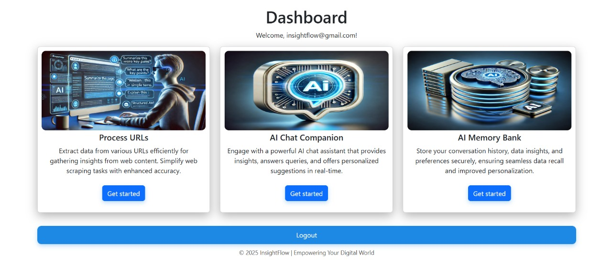

<h1 align="center">🧠 InsightFlow</h1>
<h3 align="center">AI-Driven News & Query Companion</h3>

<p align="center">
  
</p>

<p align="center">
  
  
  
  
</p>

---

## 📚 Overview

**InsightFlow** is an intelligent, modern AI system built with **Django** that helps users:

- Extract insights from **URLs**
- Chat with an **AI companion**
- Store important information in a powerful **AI Memory Bank**
- Consume real-time news through **minimal, image-first news cards**

The UI is inspired by **ChatGPT** with a clean, interactive layout and a smooth user experience.

---

## 🧭 Table of Contents

- [✨ Core Features](#-core-features)
- [🧩 System Design](#-system-design)
- [🎨 UI Highlights](#-ui-highlights)
- [🔧 Tech Stack](#-tech-stack)
- [🚀 Setup Instructions](#-setup-instructions)
- [🗂️ How It Works](#%EF%B8%8F-how-it-works)
- [🛠️ Future Upgrades](#%EF%B8%8F-future-upgrades)
- [🤝 Contributing](#-contributing)
- [📜 License](#-license)

---

## ✨ Core Features

### 🔗 URL Processing
- 📥 Extracts detailed content from any **article/blog URL**
- 📝 Generates **summaries** and key insights
- 🎭 Detects **emotion, sentiment & topics**
- 🌍 Supports **multilingual content**

---

### 💬 Chat Companion
- 💻 **ChatGPT-style interface** with a modern chat layout  
- 🧠 Remembers context **within the same session**
- 📜 Scrollable **chat history sidebar**
- 🙋‍♀️ If the user is a **guest**, shows **Login / Create Account** options

---

### 🧠 AI Memory Bank
- 📌 Stores important knowledge selected by the user
- ♻️ Reuses stored memory in future responses
- 🧾 Maintains a clean and structured memory (JSON / DB + FAISS index)

---

### 📰 Intelligent News Cards
- 🖼️ Minimal design → **Only image + heading**
- ⏱️ Fetches **real-time news**
- 🏷️ Filter by categories (e.g., tech, business, etc.)
- 📱 Responsive card layout

---

## 🧩 System Design

```
INSIGHTFLOW/
│── Insightflow/          # Django project folder
│── main/                 # Core app (views, models, logic)
│── static/
│── staticfiles/          # Collected static files
│── templates/            # HTML templates (Chat UI, pages)
│── chat_history.json     # Local session chat storage
│── db.sqlite3            # Database
│── faiss_index.pkl       # Vector index for memory bank
│── manage.py
│── requirements.txt
│── README.md

```
---
### 🎨 UI Highlights

- 💬 Chat-like interface with left sidebar and main conversation panel

- 🌗 Clean design focused on readability and interaction

- 📰 News tiles with just image + title for distraction-free scanning

- 🔍 Clear sectioning for URL Input, Chat, and Insights
---

###   Tech Stack
- Backend

- Django

- Python

- ChatGroq (Llama-3.1-70B)

- FAISS for vector-based memory indexing
---
### 🎨 Frontend

- HTML

- CSS

- JavaScript


### 🚀 Setup Instructions
1️⃣ Clone Repo
git clone https://github.com/sriramya1105/Insightflow.git
cd Insightflow

2️⃣Create a Virtual Environment
- python -m venv env
- env\Scripts\activate      # Windows
- source env/bin/activate   # Mac/Linux

3️⃣ Install Dependencies
  pip install -r requirements.txt

4️⃣ Set Environment Variables

Create a .env file in the project root:

### GROQ_API_KEY=your_key
### NEWS_API_KEY=your_key
### SECRET_KEY=your_django_secret

5️⃣ Run Migrations
python manage.py migrate

6️⃣ Start Server
python manage.py runserver


Open your browser and go to:

http://127.0.0.1:8000/

### 🛠️ Future Upgrades

- 📄 PDF → Insights (upload & summarize documents)

- 🎙️ Voice conversation support

- 💾 Cross-session persistent chat history

- 🧪 Advanced filters for news & analytics

- 📊 More visual analytics on user interactions

### 🤝 Contributing

### Contributions are always welcome! 💚

- Fork the repository

- Create a new feature branch

- Commit your changes

- Open a Pull Request

- You can also open an Issue for bugs, ideas, or improvements.
